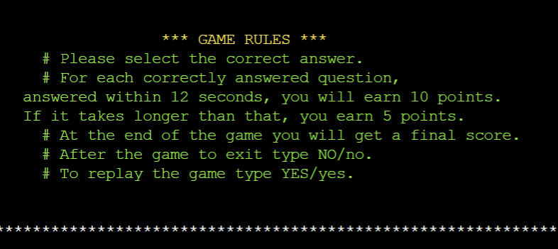

* I used [am I responsive](https://ui.dev/amiresponsive?url=https://python-quiz-da8ccddf3267.herokuapp.com/)
* Live deployment [Python quiz](https://python-quiz-da8ccddf3267.herokuapp.com/) 

Python quiz game can be a fun and effective way for users to learn more about the language. Here's a general outline of how I have structure my quiz game:

 **Introduction**: The purpose of the quiz game is for the users to learn python while answering questions, I creatd a question bank with a variety of questions that cover different topics in Python such as syntax, data types, control structures, functions....to ensure that the questions have multiple-choice options for users to select from.

 **User Interaction**: Prompt the user with a question and display the answer options. Allow the user to select an answer by inputting the corresponding option number.

 **Scoring**: Keep track of the user's score as they answer questions. Award points for correct answers , the more you answer within 12 seconds you earn more, so your speed matters and at the end it displays the total score for all quetions.

 **Completion and Results**: When the user has answered all the questions, display their final score andprovide an option to replay or exit the game.

## Table of Contents
+ [UX](#ux "UX")
  + [Site Purpose](#site-purpose "Site Purpose")
  + [Audience](#audience "Audience")
  + [Communication](#communication "Communication")
  + [Current User Goals](#current-user-goals "Current User Goals")
  + [New User Goals](#new-user-goals "New User Goals")
  + [Future Goals](#future-goals "Future Goals")
+ [Design](#design "Design")
   + [Mock-up](#mock-up "Wireframes")
+ [Features](#features "Features")
  + [Existing Features](#existing-features "Existing Features")
    + [Landing Page](#landing-page "Landing Page")
    + [Game Rules](#game-rules "Game Rules")
    + [Enter Country Location](#enter-country-location "Enter Country Location")
    + [Enter Username](#enter-username "Enter Username")
    + [Possible Outcomes](#possible-outcomes "Possible Outcomes")
    + [Replay and Exit](#replay-and-exit "Play Again or Quit App")
  + [Features Left to Implement](#features-left-to-implement "Features Left to Implement")
+ [Testing](#testing "Testing")
  + [Validator Testing](#validator-testing "Validator Testing")
  + [Manual Testing](#manual-testing "Manual Testing")
  + [Bugs](#bugs "Bugs")
  + [Remaining Bugs](#remaining-bugs "Remaining bugs")
+ [Technologies Used](#technologies-used "Technologies Used")
  + [Main Language](#main-language "Main Language")
  + [Frameworks, Libraries & Programs](#frameworks-libraries-programs "Frameworks, Libraries & Programs")
+ [Deployment](#deployment "Deployment")
    + [Version Control](#version-control "Version Control")
    + [Page Deployment](#page-deployment "Page Deployment")
+ [Credits](#credits "Credits")
  + [Content](#content "Content")
  + [Acknowledgements](#acknowledgements "Acknowledgements")

## UX

### Site Purpose:
To provide a simple and fun platform where the user can play while learning about python through quiz and multi-choice answers.

### Audience:
Python learners, anyone who is interessed in learning python, it can be a programmer from a different language who wants to divert to python too. 

### Communication:
The game interface employs clear and colored print statements to guide users through each turn, ensuring an error-free and engaging gaming experience. This color-coded approach enhances text readability and adds a visually appealing element to the game.

### Current User Goals:
The primary goal for current users is to be entertained and engaged in playing while learning something productive at the same time playing multiple rounds of the quiz Game will help the user master alot of python rules, it will help the user love python before stating to code. 

### New User Goals:
New users are encouraged to experiment with the computer-based version of the python quiz game and widen there python knowledge, the multi-choice answers helps them to guess the correct answer from the given options.

### Future Goals:
Make the game more challenging by introducing multiple difficulty levels for the user to choose to play and implementing a scoring leaderboard. Moreover, I intend to enhance the website's user appeal through the implementation of aesthetic styling and a structured layout. To achieve this objective, I need to use a web framework such as Flask or Django, which allows me serve web pages and static assets like CSS files. 

[Back to top](<#table-of-contents>)

## Design
### Mock-up:
 live link (https://ui.dev/amiresponsive?url=https://python-quiz-da8ccddf3267.herokuapp.com/)

### Flowchart:
!I used [Lucid](https://www.lucidchart.com/) to create a flowchart, to enhance the overall structure.

[Back to top](<#table-of-contents>)

## Features

### Existing Features:

#### Landing Page:

The landing page displays the game's title along with the game rules. To add an element of visual appeal, the text is rendered in red color, and the sentences are animated using the typewriter function. This approach is aimed at enriching the user's experience.

### Game Rules
Players will review the game rules before beginning the P3 python quiz game. They can do so by scrolling.
* 

### Enter Location
Players will type in the conutry they are currently located, if the country does not exist they will be prompted with an invalid message until the player enters the correct country.
* 

### Enter Username
Beneath the rules section, a prompt awaits the user, inviting them to input their name or choose to play anonymously to initiate the game. An image illustrating when the user gives their name's input can be found above, in the "Game Rules" picture.
* 

### Possible Outcomes:
The player may encounter three potential scenarios when selecting an answer form the given options: 
+ The `correct answer`, the `incorrect answer` and the `invalid input` from the given options this is to avoid little mistakes that can be done by the user enhencing user's experience.
  * 
  * 
+ If the input answer is not from the specified option then the player will be prompted with an invalid or error message until the player enters the correct input number provided.
  * 

#### Reply or Exit
After the game, regardless of whether the player wins or loses, a prompt will appear asking if they wish to continue or end the game `Reply` or `Exit`. The player can choose to keep playing or quit the game by typing yes for replay and no for exit.  
    When you type yes to replay the game, it starts from the question.
* 
    When you type no to exit the game, it sends a goodbye message then it exits this is for user interface
* 

### Features Left to Implement
- To make the questions random per game so when the user replays they are not in the same order as before.
- Keep track of the scores for each gaming session and create a leaderboard to store the best scores.
- Implement multiple difficulty levels.

[Back to top](<#table-of-contents>)

## Testing

### Validator Testing
* [CI PEP8 Online](https://pep8ci.herokuapp.com/). 
   * No errors were returned.

* [Lighthouse](https://pep8ci.herokuapp.com/).
    * in general it is good

### Manual Testing
Any input that is not a digit and a number from the given options they will be prompted with an invalid message until the player enters the correct input.
* 

Any input other than a yes or no letter will be considered invalid at the end of the game.
* 

### Bugs
- No bugs found.

### Remaining Bugs
* No bugs remaining from far as I know.

[Back to top](<#table-of-contents>)

## Technologies Used
### Main Language
- Python Language

### Frameworks, Libraries & Programs
- [Lucid](https://www.lucidchart.com) - to create the mock-up in preparation for the project.
- [codeanywhere](https://code.visualstudio.com/) - used as the coding environment.
- [GitHub](https://github.com/) - to store the repository for submission.
- [Heroku](https://id.heroku.com/) - to deploy the live version of the terminal.
- [AmIResponsive](https://ui.dev/amiresponsive?url=https://hangmangame-pp3-python-d5764adc1207.herokuapp.com/) - the responsive preview image on different gadgets.
- Colorama - to add colored text to improve the readability by adding a color to the print statements and improve the user experience.
- pyfiglet - to add ASCII font text in the game to improve the user experience.
- pycountry - to add all the country names for the user to type in his country location.

[Back to top](<#table-of-contents>)

## Deployment
### Version Control
The version control was maintained using git within Codeanywhere to push code to the main repository.

 * From the codeanywhere terminal type `"git add ."`, to make changes and/or updates to the files.

 * Type `"git commit -m (insert a short descriptive text)"`, which commits the changes and updates the files.

 * Use the `"git push"` command, which pushes the committed changes to the main repository. 

 ### Page Deployment
 The app was deployed to Heroku CLI. The steps to deploy are as follows:

 * After creating an account and logging in, click `"creat new"` to create a new app from the dashboard.
 * Create a unique name for the app and select my region; press `"Create app"`.
 * When you create the app, you will need to add two buildpacks from the _Settings_ tab. The ordering is as follows:
    1. `heroku/python`
    2. `heroku/nodejs`
 * Go to `"Settings"` and navigate to `Config Vars`.
 * Add Config Var. 
   * For this app I only used: `KEY` = `PORT` : `VALUE` = `8000`.
 * Add buildpacks `Python` and `NodeJS` - in this order.
 * Click the `Deploy Branch`.
 * Scroll Down to Deployment Method and select GitHub.
 * Select the repository to be deployed and connect to Heroku.
 * Scroll down to deploy: 
    * at first I used`Option 2` it selects manually deploys (Will Update manually with every "git push"). To see my progress and changes.
    * at the end I used `Option 1` it selects Automatic deploys (Will Update automatically with every "git push"). This was chosen for this project.
 * Live deployment [P3 Python quiz](https://python-quiz-da8ccddf3267.herokuapp.com/)

 [Back to top](<#table-of-contents>)

 ## Credits
For inspiration, I watched the following YouTube tutorials by:
- [Bro code](https://www.youtube.com/watch?v=zehwgTB0vV8) -Python quiz game
- [Kite](https://www.youtube.com/watch?v=m4nEnsavl6w&t=3s)
- [Colored Console Output in Python](https://www.youtube.com/watch?v=kf8kbUKeM5g) - to learn how to use colorama in the print statements to enhance the overall user experience.
- [Bytive](https://www.youtube.com/watch?v=NLqSxyKh1EU) - How to measure elapsed time in Python.
- [Learn Learn Scratch Tutorials](https://www.youtube.com/watch?v=U1aUteSg2a4) - Python - Converting text to Big ASCII Text using Pyfiglet.

To understand and implement the logic required for the game the following pages were consulted:
+ [Brock Byrd](https://brockbyrdd.medium.com/creating-a-multiple-choice-quiz-in-python-terminal-1c46123b86d5) -Creating a multiple choice quiz in Python.
+ [some quiz quetions](https://www.w3schools.com/quiztest/quiztest.asp?qtest=PYTHON) - question ideas.
+ [Change the color of text in python shell?](https://stackoverflow.com/questions/11043260/change-the-color-of-text-in-python-shell) - to print different colored text.
+ [How to make colored text in python by MiloCat](https://ask.replit.com/t/how-do-i-make-colored-text-in-python/29288/8) - to display the text in different colors.
+ [Timer](https://www.learndatasci.com/solutions/python-timer/) - as a reference how to add the execution time before the game begins. 

 [Back to top](<#table-of-contents>)

 ## Acknowledgments
A special acknowledgment to someone's name [i might delete this ](https) for he/she advice, support and encouragement.

 Elsie Nagawa 2024.

 [Back to top](<#table-of-contents>)
