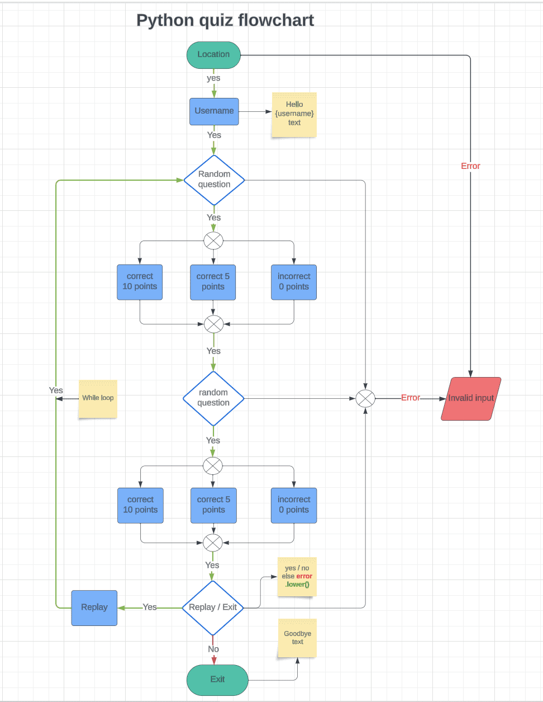

# Python quiz

* I used [am I responsive](https://ui.dev/amiresponsive?url=https://python-quiz-da8ccddf3267.herokuapp.com/) to see how it looks on different devices. 
* Live deployment [Python quiz](https://python-quiz-da8ccddf3267.herokuapp.com/) 

Python quiz game is a fun and effective way for users to learn more about the language. Here's a general outline of how I have structure my quiz game:

 **Introduction**: The purpose of the quiz game is for the users to learn python while answering questions, I creatd a question bank with a variety of random questions that cover different topics in Python such as syntax, data types, control structures, functions, etc.. to ensure that the questions have multiple-choice options for users to select from.

 **User Interaction**: Prompt the user with a question and display the answer options. Allow the user to select an answer by inputting the corresponding option number.

 **Scoring**: Keep track of the user's score as they answer questions. Award points for correct answers , the more you answer within 12 seconds you earn more, so your speed matters and at the end it displays the total score for all quetions.

 **Completion and Results**: When the user has answered all the questions, display their final score and provide an option to `replay or exit` the game.

## Table of Contents
+ [UX](#ux "UX")
  + [Site Purpose](#site-purpose "Site Purpose")
  + [Audience](#audience "Audience")
  + [Communication](#communication "Communication")
  + [Current User Goals](#current-user-goals "Current User Goals")
  + [New User Goals](#new-user-goals "New User Goals")
  + [Future Goals](#future-goals "Future Goals")
+ [Design](#design "Design")
   + [Flowchart](#flowchart "Flowchart")
+ [Features](#features "Features")
  + [Existing Features](#existing-features "Existing Features")
    + [Start game](#start-game "Start game")
    + [Game Rules](#game-rules "Game Rules")
    + [Enter Country Location](#enter-country-location "Enter Country Location")
    + [Enter Username](#enter-username "Enter Username")
    + [Possible Outcomes](#possible-outcomes "Possible Outcomes")
    + [Points Earned](#points-earned "Points Earned")
    + [Score](#Score "Score")
    + [Replay and Exit](#replay-and-exit "Play Again or Quit App")
  + [Features Left to Implement](#features-left-to-implement "Features Left to Implement")
+ [Testing](#testing "Testing")
  + [Validator Testing](#validator-testing "Validator Testing")
  + [Manual Testing](#manual-testing "Manual Testing")
  + [Bugs](#bugs "Bugs")
  + [Remaining Bugs](#remaining-bugs "Remaining bugs")
+ [Technologies Used](#technologies-used "Technologies Used")
  + [Main Language](#main-language "Main Language")
  + [Frameworks, Libraries & Programs](#frameworks-libraries-programs "Frameworks, Libraries & Programs")
+ [Deployment](#deployment "Deployment")
    + [Version Control](#version-control "Version Control")
    + [Page Deployment](#page-deployment "Page Deployment")
    + [Frok](#fork "Fork")
    + [Clone](#clone "Clone")
+ [Credits](#credits "Credits")
  + [Content](#content "Content")
  + [Acknowledgements](#acknowledgements "Acknowledgements")

## UX

### Site Purpose:
To provide a simple and fun platform where the user can play while learning about python through quiz and multi-choice answers.

### Audience:
Python learners, anyone who is interessed in learning python, it can be a programmer from a different language who wants to divert to python too. 

### Communication:
The game interface employs clear and colored print statements, ensuring an error-free and engaging gaming experience. These added colors enhances text readability and adds a visually appealing element to the game.

### Current User Goals:
The primary goal for current users is to be entertained and engaged in playing while learning something productive at the same time playing multiple rounds of the quiz Game will help the user master alot of python rules, it will help the user love python before stating to code. 

### New User Goals:
New users are encouraged to experiment with the computer-based version of the python quiz game and widen there python knowledge, the multi-choice answers helps them to guess the correct answer from the given options.

### Future Goals:
Make the game more challenging by introducing multiple difficulty levels for the user to choose to play and implementing a scoring leaderboard. 

[Back to top](<#table-of-contents>)

## Design
### Flowchart:

I used [Lucid](https://www.lucidchart.com/) to create a flowchart, to enhence the overall structure.

[Back to top](<#table-of-contents>)

## Features

### Existing Features:

#### Start game:

The landing page displays the game's title along with the game rules. To add an element of visual appeal, the text is rendered in green color and the yellow color for the rules heading. This approach is aimed at enriching the user's experience.

#### Game Rules

The user will review the game rules before beginning the python quiz game. You can do so by scrolling down.

#### Enter Location

Beneath the rules, the user is invited to input their current country they are located in, if the country does not exists they will be prompted with an `error message` until the player enters the correct country.

#### Enter Username

Beneath the country location, the user is invited to input their name and it should not be left empty to initiate the game. 

#### Possible Outcomes:
The player may encounter three potential scenarios when selecting an answer form the given options: `correct answer`, `incorrect answer`, `invalid input`.

If the input answer is not from the specified options then the player will be prompted with an invalid message until the player enters the correct input number provided. This is to avoid little mistakes that can be done by the user enhencing user's experience.

#### Points Earned

If you answer within 12 seconds you earn 10 points and if you exceed it you earn 5 points in the quiz so the user will have to play with a target of earning more points based on a timer.

#### Score

User will get a total score at the end of the game, and you can choose to reply to improve your score or exit the quiz.

### Reply or Exit
After the game, regardless of whether the player wins or loses, a prompt will appear asking if they wish to continue or exit the game. The player can choose to keep playing or quit the game by typing `yes` for replay and `no` for exit.  

#### Reply    

When you type `yes` to `Reply` the game, it starts from the random questions, that is to hence user's experience by letting the user 
 start straight away to enjoy the game since he/she is already logged in.

#### Exit    

When you type `no` to  `Exit` the game, it sends a goodbye message then it exits this is to clearly indicate to the user that the game has finished.

### Features Left to Implement
- To creat more random questions for the game to be more interesting for the user.
- Keep track of the scores for each gaming session and create a leaderboard to store the best scores.
- Implement multiple difficulty levels.

[Back to top](<#table-of-contents>)

## Testing

### Validator Testing
  #### PEP8 CI Validation
  
  No errors were found in [CI PEP8 Online testing](https://pep8ci.herokuapp.com/).

  #### Lighthouse
  
  In general it was working well with [Lighthouse testing](https://pep8ci.herokuapp.com/)

### Manual Testing
  #### Erroe message 
  
    Any input that is not a number from the given options is an error, the user will be prompted with an `error message` until the player enters the correct number.

  #### Invalid response
  
  Any input other than a `yes or no` will be considered `invalid` at the end of the game, this is not case sensitive so it can be in lower or uppercase letters.

### Browser Compatibility
`Python quiz` game was tested for functionality and appearance in the following browsers on desktop. No visible or funcional issues on all 
the browsers below.

- Google Chrome - Version 121.0.6167.161 (Official Build) (64-bit)
- Microsoft Edge - Version 121.0.2277.112 (Official build) (64-bit)
- Mozilla Firefox 122.0.1 (64-bit)

[Back to top](<#table-of-content>)

### Bugs
- while loop was not exiting but it was an operander issue, it got fixed as for now no bugs

### Remaining Bugs
- No bugs remaining as far as I know.

[Back to top](<#table-of-contents>)

## Technologies Used
### Main Language
- Python Language

### Frameworks, Libraries & Programs
- [Lucid](https://www.lucidchart.com) - to create the mock-up in preparation for the project.
- [codeanywhere](https://code.visualstudio.com/) - used as the coding environment.
- [GitHub](https://github.com/) - to store the repository for submission.
- [Heroku](https://id.heroku.com/) - to deploy the live version of the terminal.
- [AmIResponsive](https://ui.dev/amiresponsive?url=https://hangmangame-pp3-python-d5764adc1207.herokuapp.com/) - the responsive preview image on different gadgets.
- [iloveimg](https://www.iloveimg.com/) - to compress the images.
- Colorama - to add colored text to improve the readability by adding a color to the print statements and improve the user experience.
- pyfiglet - to add ASCII font text in the game to improve the user experience.
- pycountry - to add all the country names for the user to type in his country location.

[Back to top](<#table-of-contents>)

## Deployment
### Version Control
The version control was maintained using git within Codeanywhere to push code to the main repository.

 * From the codeanywhere terminal type `"git add ."`, to make changes and/or updates to the files.

 * Type `"git commit -m (insert a short descriptive text)"`, which commits the changes and updates the files.

 * Use the `"git push"` command, which pushes the committed changes to the main repository. 

 ### Page Deployment
 The app was deployed to Heroku CLI. The steps to deploy are as follows:

 * After creating an account and logging in, click `"creat new"` to create a new app from the dashboard.
 * Create a unique name for the app and select my region; press `"Create app"`.
 * When you create the app, you will need to add two buildpacks from the _Settings_ tab. The ordering is as follows:
    1. `heroku/python`
    2. `heroku/nodejs`
 * Go to `"Settings"` and navigate to `Config Vars`.
 * Add Config Var. 
   * For this app I only used: `KEY` = `PORT` : `VALUE` = `8000`.
 * Add buildpacks `Python` and `NodeJS` - in this order.
 * Click the `Deploy Branch`.
 * Scroll Down to Deployment Method and select GitHub.
 * Select the repository to be deployed and connect to Heroku.
 * Scroll down to deploy: 
    * at first I used`Option 2` it selects manually deploys (Will Update manually with every "git push"). To see my progress and changes.
    * at the end I used `Option 1` it selects Automatic deploys (Will Update automatically with every "git push"). This was chosen for this project.
 * Live deployment [Python quiz](https://python-quiz-da8ccddf3267.herokuapp.com/)

 [Back to top](<#table-of-contents>)
## Fork
### How To Fork The Repository On GitHub

It is possible to do a copy of a GitHub Repository by forking the GitHub account. The copy can then be viewed and it is also possible to do changes in the copy without affecting the original repository. To fork the repository, take these steps:

1. After logging in to GitHub, locate the repository. On the top right side of the page there is a 'Fork' button. Click on the button to create a copy of the original repository.

[Back to top](<#table-of-content>)

## Clone
### Create A Local Clone of A Project

To create a local clone of your repository, follow these steps:

1. When you are in the repository, find the code tab and click it.
2. To the left of the green GitPod button, press the 'code' menu. There you will find a link to the repository. Click on the clipboard icon to copy the URL.
3. Use an IDE and open Git Bash. Change directory to the location where you want the cloned directory to be made.
4. Type 'git clone', and then paste the URL that you copied from GitHub. Press enter and a local clone will be created.

[Back to top](<#table-of-content>)

 ## Credits
For inspiration, I watched the following YouTube tutorials by:
- [Bro code](https://www.youtube.com/watch?v=zehwgTB0vV8) -Python quiz game
- [Kite](https://www.youtube.com/watch?v=m4nEnsavl6w&t=3s)
- [Colored Console Output in Python](https://www.youtube.com/watch?v=kf8kbUKeM5g) - to learn how to use colorama in the print statements to enhance the overall user experience.
- [Bytive](https://www.youtube.com/watch?v=NLqSxyKh1EU) - How to measure elapsed time in Python.
- [Learn Learn Scratch Tutorials](https://www.youtube.com/watch?v=U1aUteSg2a4) - Python - Converting text to Big ASCII Text using Pyfiglet.

To understand and implement the logic required for the game the following pages were consulted:
+ [Brock Byrd](https://brockbyrdd.medium.com/creating-a-multiple-choice-quiz-in-python-terminal-1c46123b86d5) -Creating a multiple choice quiz in Python.
+ [some quiz quetions](https://www.w3schools.com/quiztest/quiztest.asp?qtest=PYTHON) - question ideas.
+ [Change the color of text in python shell?](https://stackoverflow.com/questions/11043260/change-the-color-of-text-in-python-shell) - to print different colored text.
+ [How to make colored text in python by MiloCat](https://ask.replit.com/t/how-do-i-make-colored-text-in-python/29288/8) - to display the text in different colors.
+ [Timer](https://www.learndatasci.com/solutions/python-timer/) - as a reference how to add the execution time before the game begins. 
+ [codedamn](https://codedamn.com/news/python/strip-whitespace-in-python) - Python Strip Whitespace: A Complete Guide
+ [stack overflow](https://stackoverflow.com/questions/51804117/conditions-are-met-but-program-not-breaking-out-of-while-loop) - conditions are met, but program not breaking out of while loop 

 [Back to top](<#table-of-contents>)

 ## Acknowledgments
 The application `Python quiz` was completed as the Portfolio Project 3 (*Python*) for the Full Stack Software Development Diploma at the [Code Institute](https://codeinstitute.net/). 
 - I would like to thank my mentor [Precious Ijege](https://www.linkedin.com/in/precious-ijege-908a00168/) for relevant feedback during the project.
- A special thanks to my cohort facilitator Ms. Kay Welfare for her   advice, support and encouragement.

 Elsie Nagawa 09.02.2024.

 [Back to top](<#table-of-contents>)
